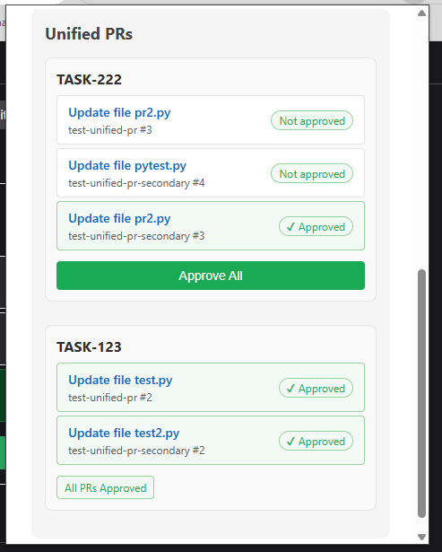
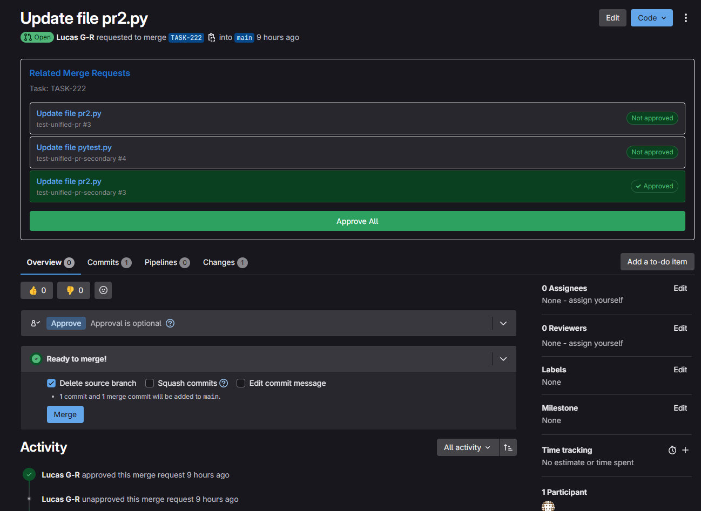
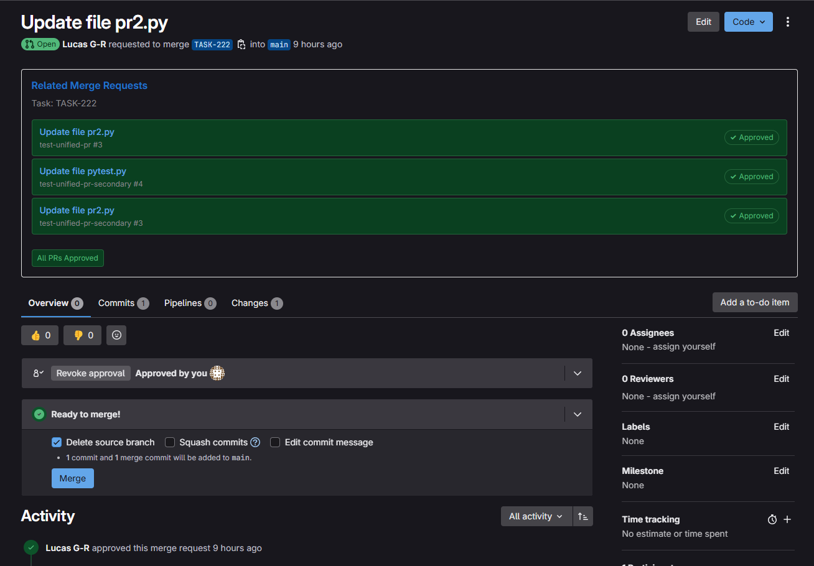

# Unified PR Viewer Extension

A Chrome extension for viewing and managing related Pull Requests across multiple GitLab repositories.

## Features

- View all PRs related to the same task across repositories
- Approve multiple PRs with a single click
- See which PRs have been approved at a glance
- Integrated directly into GitLab's merge request pages

## Screenshots

### Extension Popup

The main extension popup allows you to configure settings and view all related PRs:


All PRs related to the same task are grouped together, making it easy to track progress:



### Integrated View in GitLab

When viewing a merge request in GitLab, related PRs are displayed directly on the page, and you can easily approve all related PRs with a single click:





## Setup

1. Install the extension from the Chrome Web Store (or load unpacked for development)
2. Configure your GitLab API token in the extension popup
3. Add repositories to track
4. Set the backend URL (default: http://localhost:8000)

## Backend Setup

The extension requires a backend server to fetch and unify PR data:

```bash
# Install dependencies
pip install -r requirements.txt

# Run the server
uvicorn backend.main:app --reload
```

## Development

This extension uses:
- Vanilla JavaScript for the extension frontend
- FastAPI for the backend
- GitLab API for fetching and managing PRs

## How It Works

1. The extension detects when you're viewing a GitLab merge request
2. It extracts the task name from the branch name
3. The backend fetches all PRs from configured repositories
4. The extension displays related PRs (with the same task name) directly in GitLab
5. You can approve all related PRs with a single click

## License

MIT