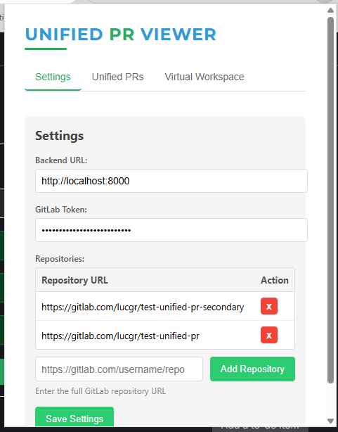
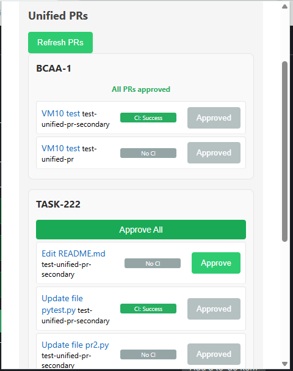
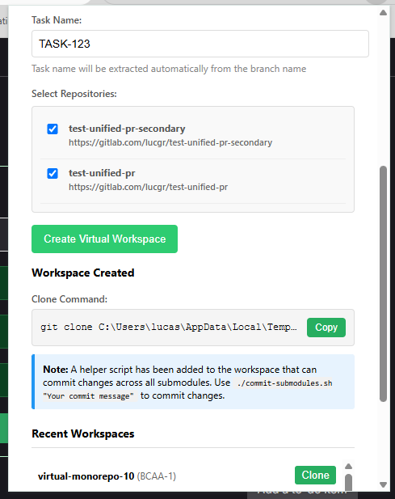
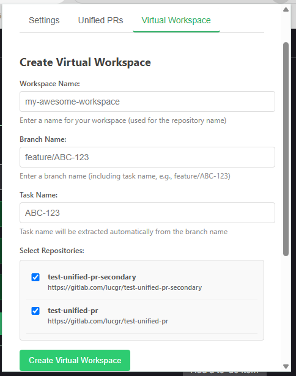
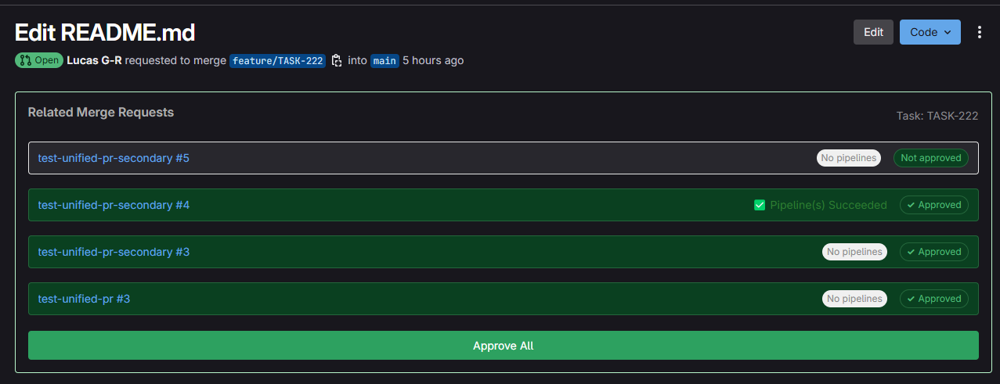

# Unified PR Viewer Extension

A Chrome extension for viewing and managing related Pull Requests across multiple GitLab repositories.

## Features

- View all PRs related to the same task across repositories
- Approve multiple PRs with a single click
- See which PRs have been approved at a glance
- Monitor pipeline status for all related PRs
- Create virtual workspaces for easier multi-repository development
- Integrated directly into GitLab's merge request pages

## Screenshots

### Extension Popup

#### Settings Tab
Configure your GitLab API token, backend URL, and repositories to monitor:



#### Unified PRs Tab
View all PRs grouped by task, with approval and pipeline status:



#### Virtual Workspace Tab
Create virtual workspaces that combine multiple repositories for easier development:




### Integrated View in GitLab

When viewing a merge request in GitLab, related PRs are displayed directly on the page:



You can see approval status for all related PRs, approve all related PRs with a single click, and monitor pipeline status for all related PRs.

## Virtual Workspace

The virtual workspace feature creates a unified repository with submodules for each selected repository. It includes helper scripts to manage multiple repositories at once:

```bash
# Initialize all submodules in the workspace
./multi-repo init

# Commit changes across all repositories
./multi-repo commit "Your commit message"

# Push changes to all repositories
./multi-repo push

# Pull latest changes for all repositories
./multi-repo pull

# Check status of all repositories
./multi-repo status

# Create or checkout branches across all repositories
./multi-repo branch <branch-name>
./multi-repo checkout <branch-name>

# Create pull requests for all repositories with changes
./multi-repo pr "Your PR title"

# This will:
# - Ask for a commit message (also used as PR description)
# - Ask for a target branch (defaults to main)
# - Ask for a branch name to use for all repositories (defaults to current branch)
# - Commit and push changes in all submodules
# - Create pull requests for each repository with changes
```

The PR creation command automatically commits all changes in all submodules, pushes them to the remote repositories, and creates pull requests from the current branches to the target branch (default: main). The command will prompt for a commit message (used for both the commit and PR description) and additional information, and supports both GitLab and GitHub repositories.

## Setup

1. Install the extension from the Chrome Web Store (or load unpacked for development)
2. Configure your GitLab API token in the extension popup
3. Add repositories to track
4. Set the backend URL (default: http://localhost:8000)

## Backend Setup

The extension requires a backend server to fetch and unify PR data:

```bash
# Install dependencies
pip install -r requirements.txt

# Run the server
uvicorn backend.main:app --reload
```

## Development

This extension uses:
- Vanilla JavaScript for the extension frontend
- FastAPI and Python for the backend
- GitLab API for fetching and managing PRs

## How It Works

1. The extension detects when you're viewing a GitLab merge request
2. It extracts the task name from the branch name
3. The backend fetches all PRs from configured repositories
4. The extension displays related PRs (with the same task name) directly in GitLab
5. You can approve all related PRs with a single click
6. Pipeline status is monitored for all related PRs
7. Virtual workspaces can be created for multi-repository development

## License

MIT