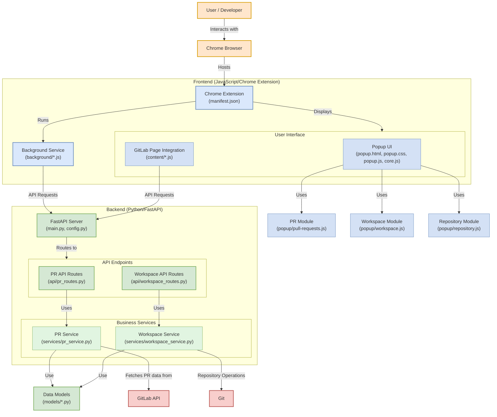

# MultiRepoHub Architecture Diagram

## Architecture Components

### User Layer
- **User/Developer**: Person interacting with the system
- **Chrome Browser**: Environment where the extension runs

### Frontend (Chrome Extension - JavaScript)
- **Extension Core**: 
  - **manifest.json**: Extension manifest defining permissions and structure
- **User Interface**:
  - **Popup UI**: 
    - **popup.html**: HTML structure of the popup
    - **popup.css**: Styling for the popup UI
    - **popup.js**: Main popup controller
    - **core.js**: Core functionality shared across popup components
  - **GitLab Page Integration**: 
    - **content/*.js**: Scripts injected into GitLab pages
- **Background Service**:
  - **background/*.js**: Background scripts for persistent operations and API communication
- **Frontend Modules**:
  - **pull-requests.js**: Handles PR visualization and management
  - **workspace.js**: Manages virtual workspace creation and configuration
  - **repository.js**: Handles repository operations and metadata

### Backend (Python FastAPI)
- **FastAPI Server**: 
  - **main.py**: Main FastAPI application entry point
  - **config.py**: Configuration settings for the backend
- **API Endpoints**:
  - **api/pr_routes.py**: Endpoints for PR operations
  - **api/workspace_routes.py**: Endpoints for workspace management
- **Business Services**:
  - **services/pr_service.py**: Business logic for PR management
  - **services/workspace_service.py**: Business logic for workspace management and Git repository operations
- **Data Models**:
  - **models/*.py**: Data models representing PRs, workspaces, repositories, etc.

### External Integration
- **GitLab API**: External system for PR data, approvals, and pipelines
- **Git**: Version control system for repository operations

### Key Interactions
1. Users interact with the extension through the browser
2. Frontend modules provide specialized functionality to the popup UI
3. Frontend components communicate with the backend via API requests
4. Backend services process requests using data models
5. PR Service interacts with GitLab API for PR data
6. Workspace Service performs Git repository operations
7. Data flows back to the frontend for presentation to the user 
