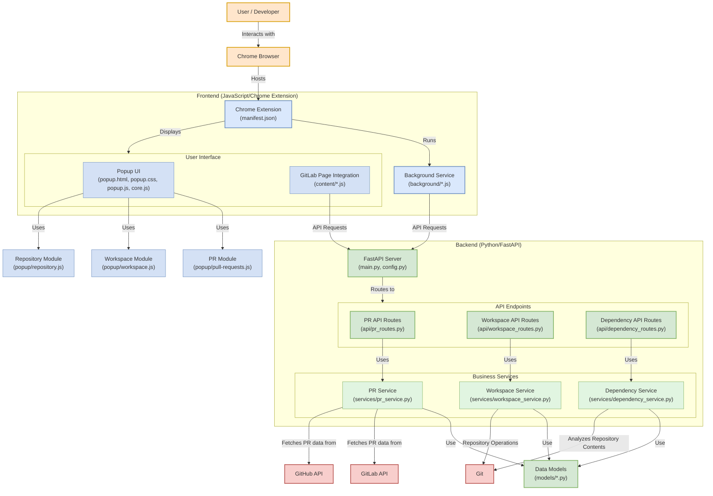

# MultiRepoHub: Architecture Overview

This document provides a comprehensive overview of the MultiRepoHub application architecture, explaining how different components interact and communicate. This document explains the responsibilities of each component and the communication flow between frontend and backend systems.

## System Architecture Diagram

## Component Responsibilities

### User Layer
- **User/Developer**: End user of the application (developer working with multiple repositories)
- **Chrome Browser**: Environment where the extension runs, providing access to web page content and extension features

### Frontend (Chrome Extension - JavaScript)

#### Extension Core
- **manifest.json**: Defines extension permissions, content scripts, background scripts, and browser action configuration
- **Background Service**: Manages persistent operations, listens for GitLab page navigation events, and maintains state across the application
  - Initiates API requests to the backend
  - Handles authentication token storage and retrieval
  - Manages tab detection and content script insertion

#### User Interface
- **Popup UI**: 
  - **popup.html**: Defines the structure of the popup interface with tabs for different features
  - **popup.css**: Styles the popup interface for a consistent user experience
  - **popup.js**: Coordinates loading of dependent JavaScript modules
  - **core.js**: Provides shared functionality across all popup components:
    - Tab navigation
    - Settings management
    - Error handling
    - API communication utilities

- **GitLab Page Integration**: 
  - Injects UI components into GitLab's merge request pages
  - Shows related PRs from other repositories
  - Provides bulk approval capabilities
  - Displays pipeline status for all related PRs

#### Frontend Modules
- **pull-requests.js**: 
  - Fetches and displays unified PR views
  - Provides PR approval functionality
  - Renders PR cards with status indicators
  - Groups PRs by task name

- **workspace.js**: 
  - Handles virtual workspace creation forms
  - Manages repository selection for workspaces
  - Initiates workspace ZIP file creation and download
  - Tracks workspace history

- **repository.js**: 
  - Manages repository list display and filtering
  - Provides repository search functionality
  - Handles adding and removing repositories from tracking

### Backend (Python FastAPI)

#### Core Components
- **FastAPI Server**: 
  - **main.py**: Application entry point, configures API routes and middleware
  - **config.py**: Manages environment variables and configuration, provides GitLab client factory

#### API Endpoints
- **api/pr_routes.py**: 
  - `/api/prs/unified`: Retrieves and unifies PRs across repositories
  - `/api/prs/{repo_url}`: Gets PRs for a specific repository
  - `/api/prs/approve`: Approves all PRs for a specific task

- **api/workspace_routes.py**: 
  - `/api/workspace/create`: Creates a virtual workspace structure
  - `/api/workspace/history`: Retrieves workspace creation history
  - `/api/workspace/download/{workspace_id}`: Downloads a previously created workspace

- **api/dependency_routes.py**:
  - `/api/dependencies/check`: Analyzes and compares dependencies across repositories
  - Supports both Python and Go dependency analysis

#### Business Services
- **services/pr_service.py**: 
  - Fetches PRs from GitLab API
  - Extracts task names from branch names
  - Groups PRs by task
  - Manages PR approval requests

- **services/workspace_service.py**: 
  - Creates parent repository structure
  - Adds repositories as Git submodules
  - Generates multi-repository helper scripts
  - Packages workspace into ZIP files

- **services/dependency_service.py**:
  - Clones repositories for analysis
  - Extracts dependency information from various file formats
  - Compares versions across repositories
  - Identifies mismatches and conflicts

#### Data Models
- **models/pr.py**: Defines PR and UnifiedPR data structures
- **models/workspace.py**: Defines workspace configuration and metadata models
- **models/dependency.py**: Defines structures for dependency comparisons

### External Integration
- **GitLab API**: Source of PR data, approval mechanisms, and pipeline information
- **GitHub API**: Alternative source for PR data from GitHub repositories
- **Git**: Used for repository operations in virtual workspaces and dependency analysis

## Communication Flows

### 1. Unified PR Management

#### Frontend to Backend Communication
1. User opens the extension popup
2. Frontend retrieves settings from Chrome Storage (backend URL, GitLab token, repositories)
3. PR module (`pull-requests.js`) makes request to `/api/prs/unified` endpoint with:
   - Repository URLs in query parameters
   - GitLab token in request headers
4. Backend processes request through `PRRoutes` and `PRService`
5. Backend returns unified PRs grouped by task name
6. Frontend renders PR cards in the popup UI

#### GitLab Page Integration
1. Content scripts detect GitLab merge request pages
2. Content scripts extract current PR information (task name from branch)
3. Request sent to backend for related PRs
4. Backend returns unified PRs for the specific task
5. Content scripts inject UI elements into GitLab page showing related PRs

#### Bulk Approval Flow
1. User clicks "Approve All" on a unified PR group
2. Frontend sends POST request to `/api/prs/approve` with:
   - Task name in query parameters
   - Repository URLs in request body
   - GitLab token in request headers
3. Backend approves each PR using GitLab API
4. Frontend updates UI to reflect new approval status

### 2. Virtual Workspace Management

#### Workspace Creation Flow
1. User configures workspace parameters in popup UI
2. User selects repositories to include
3. Frontend sends request to `/api/workspace/create` with:
   - Workspace name, branch name
   - Selected repository URLs
   - GitLab token in headers
4. Backend creates workspace structure:
   - Creates parent repository
   - Adds selected repositories as submodules
   - Generates helper scripts
   - Packages into ZIP file
5. Backend returns download URL
6. Frontend initiates file download in browser

#### Workspace History Flow
1. Frontend requests workspace history from `/api/workspace/history`
2. Backend returns list of previously created workspaces
3. Frontend displays history in popup UI
4. User can click to re-download a workspace, triggering `/api/workspace/download/{id}` request

### 3. Dependency Checking

#### Dependency Analysis Flow
1. User selects repositories for comparison in popup UI
2. User optionally specifies branches to compare
3. Frontend sends request to `/api/dependencies/check` with:
   - Repository URLs
   - Branch specifications (if provided)
   - GitLab token in headers
4. Backend:
   - Clones repositories at specified branches
   - Analyzes dependency files (requirements.txt, go.mod, etc.)
   - Compares versions across repositories
   - Returns only mismatched dependencies
5. Frontend displays comparison results in popup UI

## Security Considerations

1. **Authentication**:
   - GitLab Personal Access Token (PAT) stored securely in Chrome Storage
   - PAT sent with each request to the backend in headers
   - Backend uses PAT to authenticate with GitLab API
   - PAT is removed from `.gitmodules` before packaging workspaces to prevent exposure

2. **API Security**:
   - CORS configuration in backend to restrict access
   - Input validation for all API endpoints
   - Error handling to prevent information disclosure

## Deployment Architecture

1. **Frontend**:
   - Chrome Extension deployed through Chrome Web Store
   - All extension components packaged together

2. **Backend**:
   - FastAPI application containerized with Docker
   - Can be deployed to cloud services like Google Cloud Run
   - Stateless design allows horizontal scaling

## Feature Implementation Details

### 1. Task Name Extraction

PRs are grouped by task name, which is extracted from branch names using regex patterns. This allows the system to identify related PRs across repositories.

### 2. PR Unification Logic

The backend fetches PRs from each repository and then groups them by task name. This creates a unified view of related PRs that can be managed together.

### 3. Virtual Workspace Structure

Virtual workspaces use Git submodules to create a unified directory structure containing multiple repositories. Helper scripts are generated to streamline multi-repository operations.

### 4. Dependency Checking

The system clones repositories and analyzes dependency files to identify version mismatches. This helps ensure consistent dependency versions across microservices.

### 5. GitLab UI Integration

Content scripts inject UI components into GitLab's merge request pages, providing contextual information about related PRs without leaving the GitLab interface.

## Conclusion

The MultiRepoHub architecture is designed to address the challenges of managing code changes across multiple repositories. By providing unified interfaces for PR management, workspace creation, and dependency checking, it streamlines development workflows for multi-repository architectures.

The separation between frontend and backend allows for flexibility in deployment while maintaining a clean separation of concerns. The backend handles complex Git operations and API interactions, while the frontend provides an intuitive user interface integrated directly into the developer's workflow.
